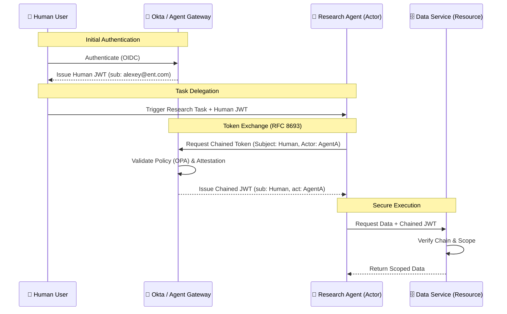

# 🔐 Federated Identity for AI Agents (NHI)


-green)


This repository outlines an architectural blueprint for **Non-Human Identity (NHI)** federation in the Agentic Enterprise. As we move from human-centric SSO to autonomous agent workflows, the industry faces a "Secret Zero" problem and a massive expansion of the attack surface.

---

## 🛑 The Problem: Identity Fragmentation

In multi-cloud environments, AI agents often rely on long-lived, static API keys or over-privileged service accounts. This creates:

* **Credential Rot:** Static secrets are rarely rotated.
* **Audit Blindness:** No cryptographic link between the human's original intent and the agent's downstream action.
* **Handshake Latency:** Standard PQC signatures add significant overhead (15KB+) to high-frequency agent calls.

---

## 🎯 The Solution: Token Chaining & Ephemeral Federation

This blueprint utilizes **RFC 8693 (OAuth 2.0 Token Exchange)** to implement "Identity-as-a-Service" for autonomous agents. 

### Key Features:
1. **Cryptographic Lineage:** Every agent action is bound to a "Subject" (Human) and an "Actor" (Agent) claim.
2. **Policy-Driven Authorization:** Rights are not static; they are calculated just-in-time via OPA (Open Policy Agent) based on contextual risk.
3. **MTC Optimization:** Utilizing Merkle Tree Certificates to reduce handshake overhead in agent-to-agent communication.

---

## 🏗️ Architecture Flow

The flow ensures that Agent B only receives a scoped token for a specific task, authorized by Agent A, which was originally triggered by a Human User.




## 🚀 Quick Start (Proof of Concept)
1. Run the OPA Policy Server
Start the local decision engine that evaluates agent token requests using the provided Rego policies.

```Bash
# Ensure Open Policy Agent (OPA) is installed
opa run --server ./agent_rights_policy.rego
```

## 2. Execute the Agent Delegation Flow
Run the simulation where a "Research Agent" requests a downstream token to trigger a "Database Agent".

```Bash
# Ensure Python 3.10+ is installed
python agent_token_exchange.py
```

### 3. Expected Output
When the script runs, the mock IdP intercepts the request, evaluates the Rego policy, and issues a restricted, cryptographically verifiable delegated token:
```text
[INFO] Research_Agent requesting delegation to Database_Agent...
[POLICY_ENGINE] Evaluating contextual risk...
[POLICY_ENGINE] Risk score: LOW. Approved for scope: 'read:anonymized_data'.
[IDP] Token Exchange Successful (RFC 8693).
[IDP] Issued Actor Token: eyJhbGciOi...
[INFO] Database_Agent executing query with delegated authority.
```

## 📬 Contact & License
Author: Alexey Bokov

Contact: alex@bokov.net

License: Apache 2.0


